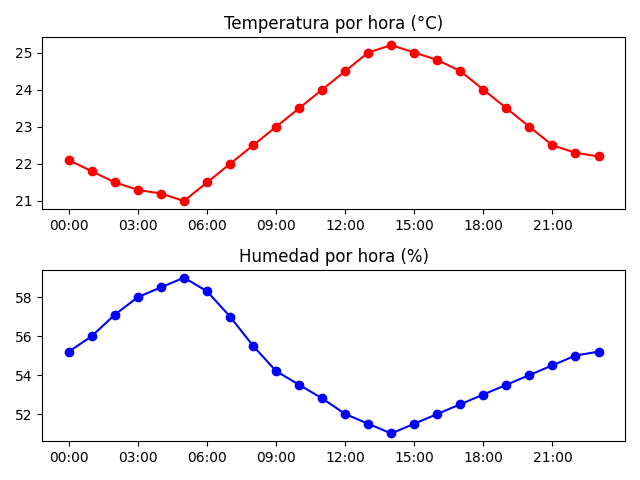
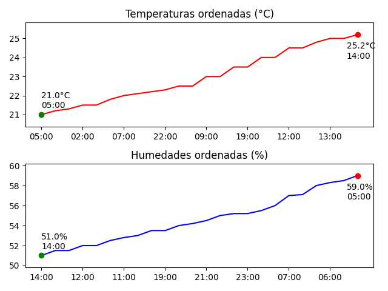

# Proyecto: Simulación de Sensores
Este proyecto simula un sistema de medición con sensores de temperatura y humedad. Los datos se cargan desde un archivo CSV y el programa permite:

Visualizar gráficas por hora y gráficas con valores ordenados.
Analizar valores mínimos y máximos registrados.
Realizar búsquedas de valores específicos de temperatura en función de la hora.

El objetivo es demostrar el uso de estructuras de datos en C++ junto con algoritmos eficientes de ordenamiento y búsqueda, fundamentales en la gestión de información de sensores en tiempo real.

## Descripción del avance 1
En este avance se implementó:

-Lectura de datos desde un archivo CSV con registros de sensores.  
-Representación gráfica de los datos con la librería matplotlibcpp.  
-Ordenamiento de datos (temperatura y humedad) para análisis de mínimos y máximos usando std::sort.  
-Búsqueda eficiente de temperaturas en un horario específico usando std::binary_search.
-Creación de las clases Sensores y un main para modelar el sistema.

Este avance muestra cómo el uso de algoritmos eficientes mejora el desempeño en programas que requieren procesar datos de sensores de forma rápida y confiable.

## Instrucciones para compilar el avance de proyecto  

Este proyecto utiliza **C++17**, la librería [matplotlibcpp](https://github.com/lava/matplotlib-cpp) para graficar y requiere tener instalado **Python** con **NumPy**.  

### Dependencias necesarias  

1. **Compilador C++ compatible con C++17** (g++, clang o MSVC).  
2. **Python 3.x** (se recomienda 3.6 o superior).  
3. **NumPy** (para las cabeceras de inclusión).  
```bash
   pip install numpy
```
4. matplotlib (para graficar con Python desde C++).
```bash
pip install matplotlib
```
### Instalación por sistema operativo
- **Linux (Ubuntu/Debian)**
```
sudo apt update
sudo apt install g++ python3-dev python3-pip
pip3 install numpy matplotlib
```
- **macOS**
En macOS se recomienda usar Homebrew:
```
brew install gcc python3
pip3 install numpy matplotlib
```
- **Windows**

1. **Instalar un compilador C++**  
   - Opción recomendada: [MSYS2](https://www.msys2.org/)  
     Una vez instalado, abre la terminal de MSYS2 y ejecuta:  
     ```bash
     pacman -Syu
     pacman -S mingw-w64-x86_64-gcc
     ```
   - Alternativa: instalar [MinGW-w64](http://mingw-w64.org/) y agregar `g++` al PATH.  

2. **Instalar Python**  
   - Descarga e instala [Python 3.x](https://www.python.org/downloads/).  
   - Durante la instalación, marca la casilla **“Add Python to PATH”**.  

3. **Instalar dependencias de Python**  
   Abre **cmd** o **PowerShell** y ejecuta:  
```
pip install numpy matplotlib
```
4. **Verificar rutas de NumPy y Python**
Para obtener la ruta correcta de las cabeceras de NumPy, ejecuta:  
```
python -c "import numpy; print(numpy.get_include())"
```
## Instrucciones para ejecutar el avance de proyecto
Compilación manual (ejemplo)
Supongamos que la ruta de NumPy es C:\Users\TuUsuario\AppData\Local\Programs\Python\Python311\Lib\site-packages\numpy\core\include:
```
g++ *.cpp -std=c++17 ^
-I. ^
-IC:\Users\TuUsuario\AppData\Local\Programs\Python\Python311\include ^
-IC:\Users\TuUsuario\AppData\Local\Programs\Python\Python311\Lib\site-packages\numpy\core\include ^
-LC:\Users\TuUsuario\AppData\Local\Programs\Python\Python311\libs ^
-lpython311 ^
-o primer_avance.exe
```
Ejecutar el programa:
```
./primer_avance.exe
```

## Descripción de las entradas del avance de proyecto
- **Archivo de entrada**  
El programa dispone de un archivo datos.csv que contiene los registros de cada sensor con el siguiente formato:
```
Lectura,Fecha,Temperatura,Humedad  
1,2025-09-25 00:00:00,22.1,55.2  
2,2025-09-25 01:00:00,21.8,56.0  
3,2025-09-25 02:00:00,21.5,57.1  
4,2025-09-25 03:00:00,21.3,58.0  
...
```
-Lectura: número de lectura.  
-Fecha: fecha y hora (AAAA-MM-DD HH:MM:SS).  
-Temperatura: valor en °C.  
-Humedad: valor en %.

- **Datos en consola**  
Después de mostrar las gráficas pide y le valida al usuario buscar la temperatura en una hora específica de las mostradas:
```
Horas disponibles (formato HH:MM):
00:00, 01:00, 02:00
03:00, 04:00, 05:00
06:00, 07:00, 08:00
...

Ingrese la hora a buscar (HH:MM): 
```

## Descripción de las salidas del avance de proyecto    
- **Gráfica de temperatura y humedad a lo largo del tiempo.**  


- **Gráfica de datos ordenados con identificación de valores extremos.**  


- **Resumen en consola**
 
-Número de lecturas, valores mínimos, máximos y promedio de cada sensor.  
-Alertas (ej. detección de fiebre por temperatura).  
-Resultados de búsquedas específicas por hora.

## Desarrollo de competencias
En este primer avance se emplea std::sort para ordenar vectores de datos de sensores.
- std::sort está implementado con Introsort, una combinación de **Quicksort**, **Heapsort** y **Insertion sort.**
- Su complejidad promedio es **O(n log n)**, mientras que en el peor caso está garantizado un **O(n log n)** gracias a la caída a **Heapsort.**

Esto significa que ordenar incluso grandes volúmenes de lecturas (miles de registros de sensores) sigue siendo computacionalmente eficiente.
Por otro lado, se usa std::binary_search para buscar un horario específico:

- Este algoritmo requiere que el vector esté ordenado previamente.
- Tiene complejidad **O(log n)**, ya que divide repetidamente el rango de búsqueda a la mitad.

Así que, en el programa el **ordenamiento** asegura que los datos de temperatura estén organizados cronológicamente o por magnitud, mientras que la **búsqueda binaria** permite al usuario encontrar de manera eficiente la temperatura en una hora específica sin recorrer toda la estructura.

