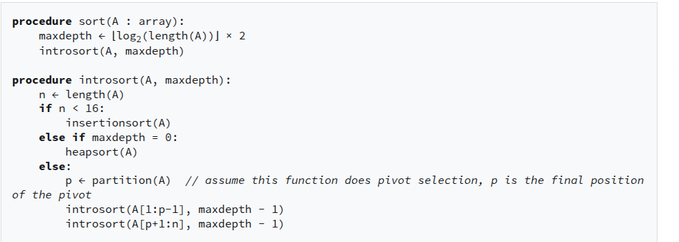

# Proyecto: Simulación de Sensores
Este proyecto simula un sistema de medición con sensores de temperatura y humedad. Los datos se cargan desde un archivo CSV y el programa permite:

Visualizar gráficas por hora y gráficas con valores ordenados.
Analizar valores mínimos y máximos registrados.
Realizar búsquedas de valores específicos de temperatura en función de la hora.

El objetivo es demostrar el uso de estructuras de datos en C++ junto con algoritmos eficientes de ordenamiento y búsqueda, fundamentales en la gestión de información de sensores en tiempo real.

## Descripción del avance 1
En este avance se implementó:

-Lectura de datos desde un archivo CSV con registros de sensores.  
-Representación gráfica de los datos con la librería matplotlibcpp.  
-Ordenamiento de datos (temperatura y humedad) para análisis de mínimos y máximos usando std::sort.  
-Búsqueda eficiente de temperaturas en un horario específico usando std::binary_search.
-Creación de las clases Sensores y un main para modelar el sistema.

Este avance muestra cómo el uso de algoritmos eficientes mejora el desempeño en programas que requieren procesar datos de sensores de forma rápida y confiable.

## Descripción del avance 2
Se implementó una modificación en el sistema de sensores reemplazando los vectores originales por listas doblemente enlazadas (std::list) para el almacenamiento de lecturas y timestamps, manteniendo toda la funcionalidad existente. Esta transformación cambia la estructura de datos de un vector (acceso aleatorio) a una lista (acceso secuencial), ofreciendo inserción y eliminación en tiempo constante O(1) en cualquier posición, eliminación de la necesidad de realocación de memoria, y estabilidad de iteradores. Para garantizar compatibilidad con las librerías de graficado y algoritmos STL, se implementaron métodos de conversión eficientes que transforman las listas a vectores cuando es necesario, permitiendo que todas las operaciones de ordenamiento, búsqueda binaria y visualización funcionen sin modificaciones en el código cliente. El sistema ahora combina la eficiencia de inserción de las listas con la potencia de acceso aleatorio de los vectores cuando se requiere.

## Cambios sobre el primer avance

1. Reemplacé std::vector por std::list en la clase Sensor para las lecturas y timestamps.
2. Mantuve métodos de conversión getLecturas() y getTimestamps() que convierten las listas a vectores para compatibilidad con librería de gráficos.
3. Implementé algoritmos con iteradores para trabajar eficientemente con las listas.
4. Modifiqué getTimestampMaximo() y getTimestampMinimo() para usar iteradores en lugar de índices.
5. El archivo main.cpp se adaptó para usar las conversiones a vector cuando es necesario para matplotlib.

## Descripción del avance 3
En este avance se ha añadido la funcionalidad de escritura de archivos CSV para guardar los datos de temperatura y humedad ordenados, tal como se muestran en la segunda gráfica. Se han generado dos archivos: temps.csv y hums.csv que contienen las lecturas ordenadas de menor a mayor, junto con la hora en la que se registraron. Esta funcionalidad se integra sin modificar la funcionalidad existente del proyecto.

### Cambios sobre el segundo avance
1. Implementación de escritura de archivos CSV para datos ordenados: Se decidió añadir esta funcionalidad para permitir el almacenamiento persistente de los datos ordenados, lo cual facilita su análisis posterior y la posibilidad de ser utilizados por otras aplicaciones. La razón principal es que los datos ordenados, que ya se calculan para la gráfica, pueden ser de interés para el usuario y no solo para visualización temporal.
2. Nueva función guardarDatosOrdenadosCSV: Esta función se encarga de escribir en disco los vectores de pares (valor, hora) ya ordenados. Se eligió el formato CSV por su simplicidad y compatibilidad con una gran variedad de herramientas. La función se llama desde graficarOrdenadas justo después de ordenar los datos, asegurando que los archivos reflejen la misma información que se muestra en la gráfica.
   
## Instrucciones para compilar el avance de proyecto  

Este proyecto utiliza **C++17**, la librería [matplotlibcpp](https://github.com/lava/matplotlib-cpp) para graficar y requiere tener instalado **Python** con **NumPy**.

### Dependencias necesarias  

1. **Compilador C++ compatible con C++17** (g++, clang o MSVC).  
2. **Python 3.x** (se recomienda 3.6 o superior).  
3. **NumPy** (para las cabeceras de inclusión).  
```bash
   pip install numpy
```
4. matplotlib (para graficar con Python desde C++).
```bash
pip install matplotlib
```
### Instalación por sistema operativo
- **Linux (Ubuntu/Debian)**
```
sudo apt update
sudo apt install g++ python3-dev python3-pip
pip3 install numpy matplotlib
```
- **macOS**
En macOS se recomienda usar Homebrew:
```
brew install gcc python3
pip3 install numpy matplotlib
```
- **Windows**

1. **Instalar un compilador C++**  
   - Opción recomendada: [MSYS2](https://www.msys2.org/)  
     Una vez instalado, abre la terminal de MSYS2 y ejecuta:  
     ```bash
     pacman -Syu
     pacman -S mingw-w64-x86_64-gcc
     ```
   - Alternativa: instalar [MinGW-w64](http://mingw-w64.org/) y agregar `g++` al PATH.  

2. **Instalar Python**  
   - Descarga e instala [Python 3.x](https://www.python.org/downloads/).  
   - Durante la instalación, marca la casilla **“Add Python to PATH”**.  

3. **Instalar dependencias de Python**  
   Abre **cmd** o **PowerShell** y ejecuta:  
```
pip install numpy matplotlib
```
4. **Verificar rutas de NumPy y Python**
Para obtener la ruta correcta de las cabeceras de NumPy, ejecuta:  
```
python -c "import numpy; print(numpy.get_include())"
```
## Instrucciones para ejecutar el avance de proyecto
Compilación manual (ejemplo)
Supongamos que la ruta de NumPy es C:\Users\TuUsuario\AppData\Local\Programs\Python\Python311\Lib\site-packages\numpy\core\include:
```
g++ *.cpp -std=c++17 ^
-I. ^
-IC:\Users\TuUsuario\AppData\Local\Programs\Python\Python311\include ^
-IC:\Users\TuUsuario\AppData\Local\Programs\Python\Python311\Lib\site-packages\numpy\core\include ^
-LC:\Users\TuUsuario\AppData\Local\Programs\Python\Python311\libs ^
-lpython311 ^
-o tercer_avance.exe
```
Ejecutar el programa:
```
./tercer_avance.exe
```
## Videos de avance de proyecto
[Segundo avance](https://youtu.be/M7sS9IyE3Gg)  
[Tercer avance](https://youtu.be/aaZZjgXJRuA)

## Descripción de las entradas del avance de proyecto
- **Archivo de entrada**  
El programa dispone de un archivo datos.csv que contiene los registros de cada sensor con el siguiente formato:
```
Lectura,Fecha,Temperatura,Humedad  
1,2025-09-25 00:00:00,22.1,55.2  
2,2025-09-25 01:00:00,21.8,56.0  
3,2025-09-25 02:00:00,21.5,57.1  
4,2025-09-25 03:00:00,21.3,58.0  
...
```
-Lectura: número de lectura.  
-Fecha: fecha y hora (AAAA-MM-DD HH:MM:SS).  
-Temperatura: valor en °C.  
-Humedad: valor en %.

- **Datos en consola**  
Después de mostrar las gráficas pide y le valida al usuario buscar la temperatura en una hora específica de las mostradas:
```
Horas disponibles (formato HH:MM):
00:00, 01:00, 02:00
03:00, 04:00, 05:00
06:00, 07:00, 08:00
...

Ingrese la hora a buscar (HH:MM): 
```

## Descripción de las salidas del avance de proyecto    
- **Gráfica de temperatura y humedad a lo largo del tiempo.**  


- **Gráfica de datos ordenados con identificación de valores extremos.**  


- **Resumen en consola**
 
-Número de lecturas, valores mínimos, máximos y promedio de cada sensor.  
-Alertas (ej. detección de fiebre por temperatura).  
-Resultados de búsquedas específicas por hora.

- **Archivos temps.csv y hums.csv**  
Los archivos de salida tendrán el siguiente formato:
```
Temperatura,Hora
36.50,08:00
36.70,08:15
... (resto de temperaturas ordenadas de menor a mayor)
```
```
Humedad,Hora
45.00,08:00
46.20,08:15
... (resto de humedades ordenadas de menor a mayor)
```

## Desarrollo de competencias

### SICT0301: Evalúa los componentes
#### Hace un análisis de complejidad correcto y completo para los algoritmos de ordenamiento usados en el programa.
### SICT0301: Evalúa los componentes
#### Hace un análisis de complejidad correcto y completo para los algoritmos de ordenamiento usados en el programa.
He desarrollado esta competencia al realizar un análisis de complejidad para cada componente del programa, incluyendo un análisis detallado del algoritmo de ordenamiento std::sort (Introsort) utilizado en las funciones graficarOrdenadas() y buscarTemperaturaPorHora().

#### Análisis de std::sort():

Según la referencia de [cppreference](https://en.cppreference.com/w/cpp/algorithm/sort.html) la implementación típica de std::sort() utiliza Introsort, que es una combinación de:

1. Quicksort (como algoritmo principal)
2. Heapsort (para evitar el peor caso de Quicksort)
3. Insertion sort (para arreglos pequeños)

#### Quick sort

Mejor caso O(n log n)  
Caso promedio O(n log n)  
Peor caso O(n²)

#### Heap sort

Mejor caso O(n log n)  
Caso promedio O(n log n)  
Peor caso O(n log n)

#### Insertion sort

Mejor caso O(n) (si ya está casi ordenado)  
Caso promedio O(n²)  
Peor caso O(n²)

Entonces, la complejidad final de std::sort() que usa Introsort para el mejor caso es O(n) si el arreglo es pequeño (n <= 16) y si el arreglo es grande (n > 16) sería O(n log n). En cambio, para el caso promedio y peor caso se trata de una complejidad de O(n²) si el arreglo es pequeño (n <= 16) ya que se usaría insertion-sort, en cambio para arreglos más grandes (n > 16) tendría O(n log n) porque se usaría Quick o Heap sort.



Para el programa:

Número de elementos (n): El sistema carga datos de sensores típicamente con 24 lecturas (una por hora), por lo que n = 24.
Cálculo de maxdepth: Para n = 24, maxdepth = ⌊log₂(24)⌋ × 2 ≈ 4 × 2 = 8.

Flujo de ejecución:
n = 24 > 16, por lo que no usa Insertion Sort directamente.
Se inicia con Quicksort recursivo, disminuyendo maxdepth en cada nivel.
Si maxdepth llega a 0 (después de 8 niveles recursivos), cambia a Heapsort.
Esto garantiza que el peor caso sea O(n log n).

Complejidad final de std::sort en el programa:

Mejor caso: O(n log n) - Datos parcialmente ordenados que permiten particiones balanceadas.  
Caso promedio: O(n log n) - Comportamiento típico de Quicksort.  
Peor caso: O(n log n) - Cuando se activa Heapsort al alcanzar maxdepth = 0.  

#### Análisis de std::binary_search():

Complejidad mejor caso: O(1) cuando el elemento está en la posición media
Complejidad peor caso: O(log n) cuando busca en todo el rango
Complejidad promedio: O(log n)
Requiere datos previamente ordenados con std::sort()

#### Análisis de std::lower_bound():

Complejidad mejor caso: O(1)  
Complejidad peor caso: O(log n)  
Complejidad promedio: O(log n)  

Utilizado para encontrar la posición exacta después de binary_search

#### Análisis de std::find():

Complejidad mejor caso: O(1) - elemento en primera posición  
Complejidad peor caso: O(n) - elemento en última posición o no existe  
Complejidad promedio: O(n)

Usado en graficarOrdenadas() para localizar posiciones de valores extremos.

#### Hace un análisis de complejidad correcto y completo de todas las estructuras de datos y cada uno de sus usos en el programa.
He desarrollado esta competencia mediante un análisis de la estructura de datos std::list implementada y su comparación con la anterior implementación con std::vector. En la clase Sensor se demuestra este análisis al documentar las complejidades de todas las operaciones:

#### Operaciones con std::list (implementación actual):

push_back(): O(1) en todos los casos.  
push_front(): O(1) en todos los casos.  
insert() en una posición: O(1) si se tiene el iterador, pero O(n) para encontrar la posición.  
erase(): O(1) si se tiene el iterador, pero O(n) para encontrar el elemento.  
Acceso por índice: O(n) en el peor caso (ya que debe recorrer desde el inicio o hasta el final).  
size(): O(1) en todas las implementaciones modernas.  
max_element(), min_element(): O(n) en todos los casos.  

#### Operaciones con std::vector (implementación anterior):

push_back(): O(1) amortizado (el peor caso es O(n) cuando se redimensiona).  
insert() en una posición: O(n) en el peor caso (por desplazamiento de elementos).  
erase(): O(n) en el peor caso (por desplazamiento de elementos).  
Acceso por índice: O(1) en todos los casos.  
size(): O(1).  
max_element(), min_element(): O(n) en todos los casos.

#### Hace un análisis de complejidad correcto y completo para todos los demás componentes del programa y determina la complejidad final del programa.
He desarrollado esta competencia al realizar un análisis de complejidad completo para todas las operaciones del programa.

Complejidad final del programa: La complejidad general sigue estando dominada por las operaciones de ordenamiento (O(n log n)) en las funciones graficarOrdenadas y buscarTemperaturaPorHora. Las operaciones de lectura y escritura de archivos son O(n) y no aumentan el orden de complejidad.

Este análisis se observa en los comentarios de complejidad en el código y en la justificación de las operaciones realizadas.

### SICT0302: Toma decisiones
#### Selecciona un algoritmo de ordenamiento adecuado al problema y lo usa correctamente.
He reforzado mi competencia en selección algorítmica mediante la justificación específica de cada uso de algoritmos STL en el contexto del problema de sensores, considerando sus complejidades computacionales:

#### En graficarOrdenadas():

Seleccioné std::sort (O(n log n)) porque necesitamos ordenar completamente los datos para visualizar las tendencias, aceptando esta complejidad dado que n (número de lecturas) es manejable (typicalmente 24-48 lecturas por día) y la operación no es en tiempo real.

Usé std::find (O(n)) para localizar posiciones de valores extremos en los vectores ordenados, ya que n es pequeño después del filtrado para gráficas.

En buscarTemperaturaPorHora():

Implementé std::sort (O(n log n)) seguido de std::binary_search (O(log n)) porque el costo de ordenamiento una vez se justifica por las múltiples búsquedas rápidas posteriores.

La combinación sort + binary_search es óptima para consultas repetitivas sobre los mismos datos.

#### En la clase Sensor:

Utilicé std::max_element y std::min_element (O(n)) para cálculos estadísticos porque son simples y n es típicamente pequeño.

Para el cálculo de promedio implementé un loop manual O(n) que es igualmente eficiente.

#### Selecciona una estructura de datos adecuada al problema y la usa correctamente.
He desarrollado esta competencia mediante la selección fundamentada de std::list sobre std::vector para el almacenamiento de lecturas de sensores, basándome en el análisis detallado de complejidades:

#### Decisiones de estructura de datos:

Selección de std::list para almacenamiento principal: Por su O(1) en inserciones push_back(), crucial para un sistema que recibe lecturas continuamente de sensores sin preocuparse por realocaciones.
Uso de std::vector para algoritmos y gráficos: Mediante conversiones O(n) cuando se necesita acceso aleatorio O(1) para algoritmos STL y librerías de plotting.
Mantenimiento de std::vector para gestión de sensores: En SistemaSensores porque el número de sensores es pequeño y fijo, no requiere inserciones frecuentes.

#### Análisis de compensaciones:

Ventaja de std::list: Inserción O(1) constante vs O(1) amortizado de std::vector con posibles realocaciones O(n)
Desventaja compensada: Acceso O(n) vs O(1) de vectores, pero mitigado por conversiones estratégicas a vector cuando se necesita acceso aleatorio
Beneficio adicional: Estabilidad de iteradores durante inserciones

### SICT0303: Implementa acciones científicas
#### Implementa mecanismos para consultar información de las estructras correctos.
He implementado múltiples mecanismos robustos para consultar información de las estructuras de datos, optimizando según las complejidades algorítmicas:

#### Consultas estadísticas O(n):

getMaximo() y getMinimo() usando std::max_element y std::min_element sobre std::list
getPromedio() con iteración manual sobre la lista
getTimestampMaximo() y getTimestampMinimo() que correlacionan datos entre dos listas usando iteradores sincronizados

#### Consultas de búsqueda O(log n):

En buscarTemperaturaPorHora() implementé std::binary_search sobre datos ordenados por hora  
Uso de std::lower_bound para ubicación precisa después de la búsqueda  

#### Consultas de conversión O(n):

getLecturas() y getTimestamps() que convierten std::list a std::vector para compatibilidad  
Estas conversiones permiten usar algoritmos STL que requieren acceso aleatorio

#### Implementa mecanismos de lectura de archivos para cargar datos a las estructuras de manera correcta.
He implementado un mecanismo de lectura de archivos CSV robusto y eficiente en el método cargarDesdeCSV() de la clase SistemaSensores, con análisis de complejidad:

#### Complejidad del proceso de carga:

Apertura de archivo: O(1)  
Lectura de encabezado: O(1)  
Procesamiento de cada línea: O(n) donde n es el número de registros  
Parseo por línea: O(m) donde m es la longitud de la línea, usando std::string::find() y std::string::substr()  
Inserción de datos: O(1) por lectura gracias al uso de std::list::push_back()

### Implementa mecanismos de escritura de archivos para guardar los datos  de las estructuras de manera correcta
He implementado mecanismos de escritura de archivos correctos y eficientes en la función guardarDatosOrdenadosCSV. Esta función:

Abre los archivos temps.csv y hums.csv en modo escritura.  
Escribe los encabezados correspondientes.  
Recorre los vectores de pares (valor, hora) y escribe cada par en una línea del archivo, con el valor formateado con dos decimales.  
Cierra los archivos correctamente.  
Maneja errores en la apertura de archivos, informando al usuario si no se pudo abrir algún archivo.  

La implementación es correcta porque:

Los datos se guardan en el formato CSV estándar, con comas separando los valores y cada registro en una línea.
Se utiliza la precisión adecuada para los valores numéricos.
La función se integra de manera coherente con el flujo existente, llamándose en el momento adecuado (después de ordenar los datos y antes de graficar).

#### Mecanismos implementados:

Manejo de errores: Verificación de apertura correcta del archivo  
Parseo robusto: Uso de std::string::find() para localizar delimitadores CSV  
Conversión segura: std::stod() para conversión de strings a números  
Carga eficiente: Inserción O(1) en las listas de sensores  
Gestión de memoria: Procesamiento línea por línea sin cargar todo el archivo en memoria
