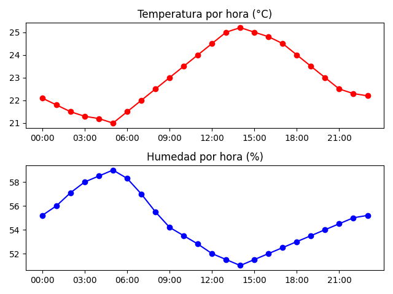
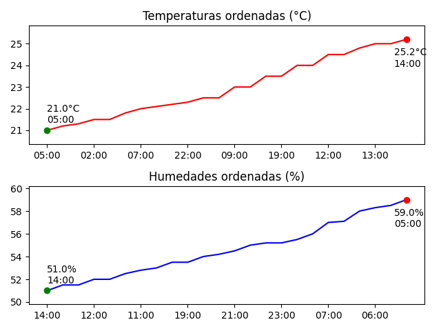

# Proyecto: Simulación de Sensores
Este proyecto simula un sistema de medición con sensores de temperatura y humedad. Los datos se cargan desde un archivo CSV y el programa permite:

Visualizar gráficas por hora y gráficas con valores ordenados.
Analizar valores mínimos y máximos registrados.
Realizar búsquedas de valores específicos de temperatura en función de la hora.

El objetivo es demostrar el uso de estructuras de datos en C++ junto con algoritmos eficientes de ordenamiento y búsqueda, fundamentales en la gestión de información de sensores en tiempo real.

## Descripción del avance 1
En este avance se implementó:

-Lectura de datos desde un archivo CSV con registros de sensores.  
-Representación gráfica de los datos con la librería matplotlibcpp.  
-Ordenamiento de datos (temperatura y humedad) para análisis de mínimos y máximos usando std::sort.  
-Búsqueda eficiente de temperaturas en un horario específico usando std::binary_search.
-Creación de las clases Sensores y un main para modelar el sistema.

Este avance muestra cómo el uso de algoritmos eficientes mejora el desempeño en programas que requieren procesar datos de sensores de forma rápida y confiable.

## Descripción del avance 2
Se implementó una modificación en el sistema de sensores reemplazando los vectores originales por listas doblemente enlazadas (std::list) para el almacenamiento de lecturas y timestamps, manteniendo toda la funcionalidad existente. Esta transformación convierte la estructura de datos lineal en una no lineal, ofreciendo inserción y eliminación en tiempo constante O(1) en cualquier posición, eliminación de necesidad de realocación de memoria, y estabilidad de iteradores. Para garantizar compatibilidad con las librerías de graficado y algoritmos STL, se implementaron métodos de conversión eficientes que transforman las listas a vectores cuando es necesario, permitiendo que todas las operaciones de ordenamiento, búsqueda binaria y visualización funcionen sin modificaciones en el código cliente. El sistema ahora combina la eficiencia de inserción de las listas con la potencia de acceso aleatorio de los vectores cuando se requiere.

## Cambios sobre el primer avance

1. Reemplacé std::vector por std::list en la clase Sensor para las lecturas y timestamps.
2. Mantuve métodos de conversión getLecturas() y getTimestamps() que convierten las listas a vectores para compatibilidad con librería de gráficos.
3. Implementé algoritmos con iteradores para trabajar eficientemente con las listas.
4. Modifiqué getTimestampMaximo() y getTimestampMinimo() para usar iteradores en lugar de índices.
5. El archivo main.cpp se adaptó para usar las conversiones a vector cuando es necesario para matplotlib.

## Instrucciones para compilar el avance de proyecto  

Este proyecto utiliza **C++17**, la librería [matplotlibcpp](https://github.com/lava/matplotlib-cpp) para graficar y requiere tener instalado **Python** con **NumPy**.

### Dependencias necesarias  

1. **Compilador C++ compatible con C++17** (g++, clang o MSVC).  
2. **Python 3.x** (se recomienda 3.6 o superior).  
3. **NumPy** (para las cabeceras de inclusión).  
```bash
   pip install numpy
```
4. matplotlib (para graficar con Python desde C++).
```bash
pip install matplotlib
```
### Instalación por sistema operativo
- **Linux (Ubuntu/Debian)**
```
sudo apt update
sudo apt install g++ python3-dev python3-pip
pip3 install numpy matplotlib
```
- **macOS**
En macOS se recomienda usar Homebrew:
```
brew install gcc python3
pip3 install numpy matplotlib
```
- **Windows**

1. **Instalar un compilador C++**  
   - Opción recomendada: [MSYS2](https://www.msys2.org/)  
     Una vez instalado, abre la terminal de MSYS2 y ejecuta:  
     ```bash
     pacman -Syu
     pacman -S mingw-w64-x86_64-gcc
     ```
   - Alternativa: instalar [MinGW-w64](http://mingw-w64.org/) y agregar `g++` al PATH.  

2. **Instalar Python**  
   - Descarga e instala [Python 3.x](https://www.python.org/downloads/).  
   - Durante la instalación, marca la casilla **“Add Python to PATH”**.  

3. **Instalar dependencias de Python**  
   Abre **cmd** o **PowerShell** y ejecuta:  
```
pip install numpy matplotlib
```
4. **Verificar rutas de NumPy y Python**
Para obtener la ruta correcta de las cabeceras de NumPy, ejecuta:  
```
python -c "import numpy; print(numpy.get_include())"
```
## Instrucciones para ejecutar el avance de proyecto
Compilación manual (ejemplo)
Supongamos que la ruta de NumPy es C:\Users\TuUsuario\AppData\Local\Programs\Python\Python311\Lib\site-packages\numpy\core\include:
```
g++ *.cpp -std=c++17 ^
-I. ^
-IC:\Users\TuUsuario\AppData\Local\Programs\Python\Python311\include ^
-IC:\Users\TuUsuario\AppData\Local\Programs\Python\Python311\Lib\site-packages\numpy\core\include ^
-LC:\Users\TuUsuario\AppData\Local\Programs\Python\Python311\libs ^
-lpython311 ^
-o segundo_avance.exe
```
Ejecutar el programa:
```
./segundo_avance.exe
```
## Enlace al video del segundo avance
[Segundo avance](https://youtu.be/M7sS9IyE3Gg)

## Descripción de las entradas del avance de proyecto
- **Archivo de entrada**  
El programa dispone de un archivo datos.csv que contiene los registros de cada sensor con el siguiente formato:
```
Lectura,Fecha,Temperatura,Humedad  
1,2025-09-25 00:00:00,22.1,55.2  
2,2025-09-25 01:00:00,21.8,56.0  
3,2025-09-25 02:00:00,21.5,57.1  
4,2025-09-25 03:00:00,21.3,58.0  
...
```
-Lectura: número de lectura.  
-Fecha: fecha y hora (AAAA-MM-DD HH:MM:SS).  
-Temperatura: valor en °C.  
-Humedad: valor en %.

- **Datos en consola**  
Después de mostrar las gráficas pide y le valida al usuario buscar la temperatura en una hora específica de las mostradas:
```
Horas disponibles (formato HH:MM):
00:00, 01:00, 02:00
03:00, 04:00, 05:00
06:00, 07:00, 08:00
...

Ingrese la hora a buscar (HH:MM): 
```

## Descripción de las salidas del avance de proyecto    
- **Gráfica de temperatura y humedad a lo largo del tiempo.**  


- **Gráfica de datos ordenados con identificación de valores extremos.**  


- **Resumen en consola**
 
-Número de lecturas, valores mínimos, máximos y promedio de cada sensor.  
-Alertas (ej. detección de fiebre por temperatura).  
-Resultados de búsquedas específicas por hora.

## Desarrollo de competencias

### SICT0301: Evalúa los componentes
#### Hace un análisis de complejidad correcto y completo para los algoritmos de ordenamiento usados en el programa.
En este avance he desarrollado un análisis de complejidad más completo para todos los algoritmos de ordenamiento utilizados en el programa. Mi aprendizaje se evidencia en el análisis que incluye no solo la complejidad promedio, sino también los casos mejor y peor para cada algoritmo STL utilizado:

#### Análisis de std::sort():

Complejidad mejor caso: O(n log n) en implementaciones estándar, aunque algunas optimizaciones pueden lograr O(n) para datos casi ordenados
Complejidad peor caso: O(n log n) garantizado gracias al uso de Introsort que combina Quicksort, Heapsort e Insertion Sort
Complejidad promedio: O(n log n)

Se utiliza en graficarOrdenadas() para ordenar temperaturas y humedades, y en buscarTemperaturaPorHora() para ordenar por hora

#### Análisis de std::binary_search():

Complejidad mejor caso: O(1) cuando el elemento está en la posición media
Complejidad peor caso: O(log n) cuando busca en todo el rango
Complejidad promedio: O(log n)
Requiere datos previamente ordenados con std::sort()

#### Análisis de std::lower_bound():

Complejidad mejor caso: O(1)  
Complejidad peor caso: O(log n)  
Complejidad promedio: O(log n)  

Utilizado para encontrar la posición exacta después de binary_search

#### Análisis de std::find():

Complejidad mejor caso: O(1) - elemento en primera posición
Complejidad peor caso: O(n) - elemento en última posición o no existe
Complejidad promedio: O(n)

Usado en graficarOrdenadas() para localizar posiciones de valores extremos.

#### Hace un análisis de complejidad correcto y completo de todas las estructuras de datos y cada uno de sus usos en el programa.
He desarrollado esta competencia mediante un análisis de la estructura de datos std::list implementada y su comparación con la anterior implementación con std::vector. En la clase Sensor se demuestra este análisis al documentar las complejidades de todas las operaciones:

#### Operaciones con std::list (implementación actual):

push_back(): O(1) para inserción de nuevas lecturas  
size(): O(1) para obtener número de lecturas  
Iteración completa: O(n) para cálculos de máximo, mínimo y promedio  
Acceso por posición: O(n) mediante iteradores secuenciales  
std::max_element() y std::min_element(): O(n) para encontrar valores extremos

#### Operaciones con std::vector (implementación anterior):

push_back(): O(1) amortizado, pero O(n) en realocaciones
Acceso por índice: O(1) para acceso aleatorio
Inserción en medio: O(n) por desplazamiento de elementos

### SICT0302: Toma decisiones
#### Selecciona un algoritmo de ordenamiento adecuado al problema y lo usa correctamente.
He reforzado mi competencia en selección algorítmica mediante la justificación específica de cada uso de algoritmos STL en el contexto del problema de sensores, considerando sus complejidades computacionales:

#### En graficarOrdenadas():

Seleccioné std::sort (O(n log n)) porque necesitamos ordenar completamente los datos para visualizar las tendencias, aceptando esta complejidad dado que n (número de lecturas) es manejable (typicalmente 24-48 lecturas por día) y la operación no es en tiempo real.

Usé std::find (O(n)) para localizar posiciones de valores extremos en los vectores ordenados, ya que n es pequeño después del filtrado para gráficas.

En buscarTemperaturaPorHora():

Implementé std::sort (O(n log n)) seguido de std::binary_search (O(log n)) porque el costo de ordenamiento una vez se justifica por las múltiples búsquedas rápidas posteriores.

La combinación sort + binary_search es óptima para consultas repetitivas sobre los mismos datos.

#### En la clase Sensor:

Utilicé std::max_element y std::min_element (O(n)) para cálculos estadísticos porque son simples y n es típicamente pequeño.

Para el cálculo de promedio implementé un loop manual O(n) que es igualmente eficiente.

#### Selecciona una estructura de datos adecuada al problema y la usa correctamente.
He desarrollado esta competencia mediante la selección fundamentada de std::list sobre std::vector para el almacenamiento de lecturas de sensores, basándome en el análisis detallado de complejidades:

#### Decisiones de estructura de datos:

Selección de std::list para almacenamiento principal: Por su O(1) en inserciones push_back(), crucial para un sistema que recibe lecturas continuamente de sensores sin preocuparse por realocaciones.
Uso de std::vector para algoritmos y gráficos: Mediante conversiones O(n) cuando se necesita acceso aleatorio O(1) para algoritmos STL y librerías de plotting.
Mantenimiento de std::vector para gestión de sensores: En SistemaSensores porque el número de sensores es pequeño y fijo, no requiere inserciones frecuentes.

#### Análisis de compensaciones:

Ventaja de std::list: Inserción O(1) constante vs O(1) amortizado de std::vector con posibles realocaciones O(n)
Desventaja compensada: Acceso O(n) vs O(1) de vectores, pero mitigado por conversiones estratégicas a vector cuando se necesita acceso aleatorio
Beneficio adicional: Estabilidad de iteradores durante inserciones

### SICT0303: Implementa acciones científicas
#### Implementa mecanismos para consultar información de las estructras correctos.
He implementado múltiples mecanismos robustos para consultar información de las estructuras de datos, optimizando según las complejidades algorítmicas:

#### Consultas estadísticas O(n):

getMaximo() y getMinimo() usando std::max_element y std::min_element sobre std::list
getPromedio() con iteración manual sobre la lista
getTimestampMaximo() y getTimestampMinimo() que correlacionan datos entre dos listas usando iteradores sincronizados

#### Consultas de búsqueda O(log n):

En buscarTemperaturaPorHora() implementé std::binary_search sobre datos ordenados por hora  
Uso de std::lower_bound para ubicación precisa después de la búsqueda  

#### Consultas de conversión O(n):

getLecturas() y getTimestamps() que convierten std::list a std::vector para compatibilidad  
Estas conversiones permiten usar algoritmos STL que requieren acceso aleatorio

#### Implementa mecanismos de lectura de archivos para cargar datos a las estructuras de manera correcta.
He implementado un mecanismo de lectura de archivos CSV robusto y eficiente en el método cargarDesdeCSV() de la clase SistemaSensores, con análisis de complejidad:

#### Complejidad del proceso de carga:

Apertura de archivo: O(1)  
Lectura de encabezado: O(1)  
Procesamiento de cada línea: O(n) donde n es el número de registros  
Parseo por línea: O(m) donde m es la longitud de la línea, usando std::string::find() y std::string::substr()  
Inserción de datos: O(1) por lectura gracias al uso de std::list::push_back()  

#### Mecanismos implementados:

Manejo de errores: Verificación de apertura correcta del archivo  
Parseo robusto: Uso de std::string::find() para localizar delimitadores CSV  
Conversión segura: std::stod() para conversión de strings a números  
Carga eficiente: Inserción O(1) en las listas de sensores  
Gestión de memoria: Procesamiento línea por línea sin cargar todo el archivo en memoria
